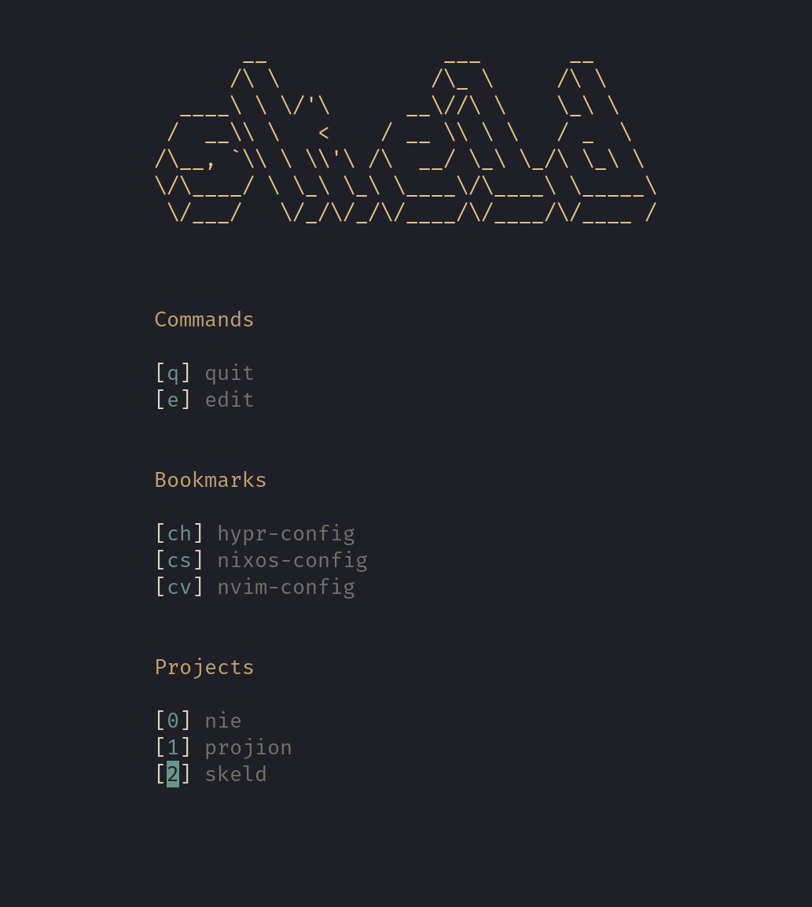

# Skeld

> Programming is constant remote code execution.[^1]

Or have you inspected all your dependencies?

Skeld mitigates this risk by opening projects in a restricted sandbox,
in which only the required paths are accessible.
Projects can be conveniently opened in a sandbox with a terminal UI:



## Installation
Note that only Linux is supported.
> [!IMPORTANT]
> [Bubblewrap](https://github.com/containers/bubblewrap) must be available in `PATH` as it is used internally to create sandboxes

### Releases
```sh
wget https://github.com/hacrvlq/skeld/releases/download/v0.1.0/skeld-0.2.0-x86_64
chmod +x skeld-0.2.0-x86_64
./skeld-0.2.0-x86_64
```

### crates.io (requires [cargo](https://www.rust-lang.org/tools/install))
```sh
cargo install skeld
# make sure that the cargo bin path (by default ~/.cargo/bin) is included in PATH
```

### Building from source (requires [the rust compiler](https://www.rust-lang.org/tools/install))
```console
$ git clone --depth=1 https://github.com/hacrvlq/skeld
$ cd skeld
$ cargo build --release
$ ./target/release/skeld
```

## Usage
```sh
skeld
# Use Up/Down/J/K to select and Enter to confirm
# The mouse is also supported
```
> [!IMPORTANT]
> Without any configuration, `skeld` displays a blank screen. Read further to create Projects/Bookmarks/Commands.

Project/Configuration files are located in `$XDG_CONFIG_HOME/skeld` (fallback `~/.config/skeld`) or `$XDG_DATA_HOME/skeld` (fallback `~/.local/share/skeld`).
These two directories are referred to as `<SKELD-DATA>`.

### Projects
To create a project, create a file `<SKELD-DATA>/projects/<project-name>.toml` with the following contents:
```toml
# root directory of project
project-dir = "..."
# path (relative to 'project-dir') to initial opened file (optional)
initial-file = "..."
# automatically open project in nix-shell if 'shell.nix' or 'default.nix' exist
auto-nixshell = true # Default: false

# whitelist paths allowing device access
whitelists-dev = [ "..." ]
# whitelist paths read-write
whitelists-rw = [
  # paths support some basic string interpolation (see #String Interpolation)
  "$(DATA)/nvim",
]
# whitelist paths read-only
whitelists-ro = [ "..." ]
# whitelist symlinks
whitelists-ln = [ "..." ]
# mount a tmpfs to the specified paths
add-tmpfs = [ "..." ]

# if 'whitelist-all-envvars' is true, all environment variables remain accessible;
# otherwise only the variables in 'whitelists-envvar' are transferred into the sandbox
whitelist-all-envvars = true # Default: false
whitelists-envvar = [ "..." ]

# include options from other project files
# NOTE: circular includes are allowed
include = [
  # relative paths are searched for in <SKELD-DATA>/include
  "rust.toml",
  # absolute paths are also supported
  "/etc/system.toml",
]

# editor to open project
[project.editor]
# used if 'default-file' is set,
# '$(FILE)' is replaced with the value of 'default-file'
cmd-with-file = ["nvim", "$(FILE)"]
# used if 'default-file' is not set
cmd-without-file = ["nvim", "."]
# whether to detached editor from terminal
# when true 'skeld' terminates after project has been opened
# should be true for GUI editors and false for TUI editors
detach = false
```

### String Interpolation
Wherever a path is expected, the following placeholders can be used:
| Placeholder        | Substitution |
| ------------------ | ------------ |
| `$[ENVVAR]`        | value of environment variable `ENVVAR` |
| `$[ENVVAR:ALTVAL]` | value of environment variable `ENVVAR` if existent, otherwise `ALTVAL` |
| `$(CONFIG)`        | `XDG_CONFIG_HOME` if existent, otherwise `~/.config` |
| `$(CACHE)`         | `XDG_CACHE_HOME` if existent, otherwise `~/.cache` |
| `$(DATA)`          | `XDG_DATA_HOME` if existent, otherwise `~/.local/share` |
| `$(STATE)`         | `XDG_STATE_HOME` if existent, otherwise `~/.local/state` |

### Configuration
The configuration is located at `$XDG_CONFIG_HOME/config.toml` (fallback `~/.config/skeld`). The following options are supported:
```toml
# banner shown at the top
# example was generated with figlet using larry3d font
banner = '''
                               __
  ___      __    ___   __  __ /\_\    ___ ___
/' _ `\  /'__`\ / __`\/\ \/\ \\/\ \ /' __` __`\
/\ \/\ \/\  __//\ \_\ \ \ \_/ |\ \ \/\ \/\ \/\ \
\ \_\ \_\ \____\ \____/\ \___/  \ \_\ \_\ \_\ \_\
 \/_/\/_/\/____/\/___/  \/__/    \/_/\/_/\/_/\/_/
'''

[colorscheme]
# colors can be specified as hex color codes
neutral = "#DCD7BA"
# or as ansi color codes (see https://en.wikipedia.org/wiki/ANSI_escape_code#8-bit)
banner = 3
heading = "#C0A36E"
label = "#727169"
keybind = "#6A9589"

[[commands]]
name = "<edit>"
keybind = "e"
command = ["nvim"]
# see 'detach' in #Projects
detach = false

[[commands]]
name = "<quit>"
keybind = "q"
# if command is empty, skeld exits without doing anything
command = []
# see 'detach' in #Projects
detach = false

[project]
# user-wide project data (see #Projects for supported options)
# below are some useful settings for the neovim editor:
whitelists-rw = [
	"$(DATA)/nvim",
	"$(STATE)/nvim",

	"/sys",
]
add-tmpfs = [
	"/tmp",
	"/var",
]
whitelists-ro = [
	"~/.bashrc",
	"$(CONFIG)/nvim",

	"/usr",
	"/etc",
]
whitelists-ln = [
	"/bin",
	"/lib",
	"/lib64",
]
whitelist-all-envvars = true

[project.editor]
cmd-with-file = ["nvim", "$(FILE)"]
cmd-without-file = ["nvim", "."]
detach = false
```

### Bookmarks
Bookmarks are located in `<SKELD-DATA>/bookmarks`.
Note that files need the extension `toml` in order to be recognized.
```toml
name = "nvim"
keybind = "cv"

[project]
# see #Projects
```

[^1]: This might be slightly overdramatized.
