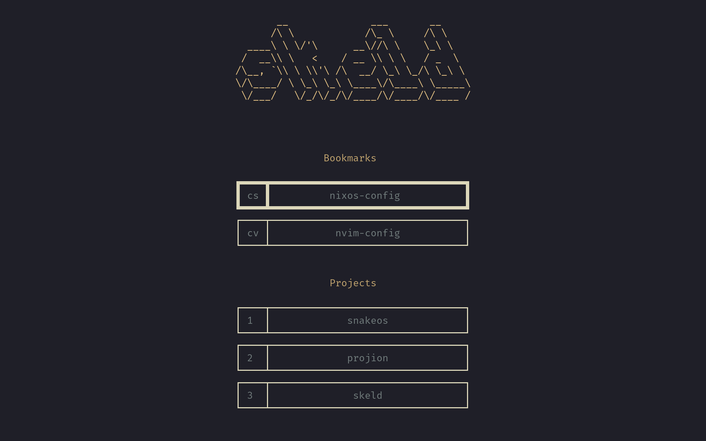

# Skeld

Skeld is a TUI tool for opening projects inside a restricted sandbox where only
the explicitly allowed paths are accessible.



Each project is defined by a TOML file:
```toml
[project]
project-dir = "~/dev/skeld"

# Paths can be whitelisted read-only.
whitelist-ro = [
  # Some string interpolation is supported.
  "$(CONFIG)/nvim",
]
# Paths can also be whitelisted read-write.
whitelist-rw = [
  "$(DATA)/nvim",
  "$(STATE)/nvim",
]

# Set the editor/IDE to use.
# This can also be set globally in the user-wide config.
[project.editor]
cmd = [ "nvim", "$(FILE:.)" ]
detach = false
```

## Installation

Note that only Linux is supported.

> [!IMPORTANT]
> Skeld depends on [Bubblewrap](https://github.com/containers/bubblewrap) to be
> available in `PATH`.

- Pre-built binaries: **[Releases](https://github.com/hacrvlq/skeld/releases)**
- Using [Cargo](https://www.rust-lang.org/tools/install): `cargo install skeld`

## Getting Started

For version `v0.5.0`, refer to
[here](https://github.com/hacrvlq/skeld/blob/v0.5.0/docs/getting-started.md).

## Building

Requires the [Rust Compiler](https://www.rust-lang.org/tools/install).
```sh
cargo build --release
./target/release/skeld
```
To build the man pages, [scdoc](https://git.sr.ht/~sircmpwn/scdoc) is required.
```sh
scdoc < docs/skeld.1.scd > skeld.1
scdoc < docs/skeld-config.5.scd > skeld-config.5
scdoc < docs/skeld-project-data.5.scd > skeld-project-data.5
```

## License

Licensed under either of

* Apache License, Version 2.0 ([LICENSE-APACHE](LICENSE-APACHE))
* MIT license ([LICENSE-MIT](LICENSE-MIT))

at your option.

## Contribution

Unless you explicitly state otherwise, any contribution intentionally submitted
for inclusion in the work by you, as defined in the Apache-2.0 license, shall be
dual licensed as above, without any additional terms or conditions.
