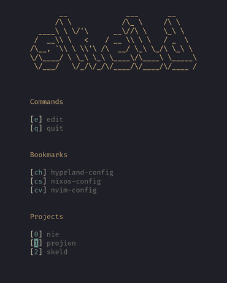

# Skeld

> Programming is constant remote code execution.[^1]

Or have you inspected all your dependencies? It's easy to write a
library that steals private ssh keys on the side.

Skeld mitigates this risk by opening projects in a **restricted sandbox**
where only the required paths are accessible.
A sandbox can be conveniently created via a **terminal UI** by selecting a
project, which is then opened in the configured editor/IDE (inside a sandbox).



The paths that the sandbox can access are defined on a per-project basis:
```toml
# projects are specified with a single TOML file

project-dir = "~/dev/skeld"
# paths can be whitelisted read-only
whitelists-ro = [
  # some string interpolation is supported (see DOCS.md#String-Interpolation)
  "$(CONFIG)/nvim",
]
# paths can be whitelisted read-write
whitelists-rw = [
  "$(DATA)/nvim",
  "$(STATE)/nvim",
]
# including options from other files is also supported
include = ["rust.toml"]
```

## Installation
Note that only Linux is supported.

> [!IMPORTANT]
> Skeld depends on [Bubblewrap](https://github.com/containers/bubblewrap), so it must be available in `PATH`.

- Pre-built binaries: **[Releases](https://github.com/hacrvlq/skeld/releases)**
- Using [Cargo](https://www.rust-lang.org/tools/install): `cargo install skeld`

## Getting Started
Without any configuration, the skeld UI displays a blank screen. Some
configuration is therefore inevitable. Below is an example configuration for
the [neovim](https://neovim.io) editor.
### Configuration
Create a file `$XDG_CONFIG_HOME/skeld/config.toml` with the following content:
```toml
[[commands]]
name = "<edit>"
keybind = "e"
command = ["nvim"]
# see DOCS.md#Project-Data-Format
detach = false

[[commands]]
name = "<quit>"
keybind = "q"
# if 'command' is empty, skeld quits immediatly
command = []
detach = false

# user-wide whitelists
[project]
# read-write whitelists
whitelists-rw = [
  "$(DATA)/nvim",
  "$(STATE)/nvim",
]
# read-only whitelists
whitelists-ro = [
  "~/.bashrc",
  "$(CONFIG)/nvim",

  "/usr",
  "/etc",
]
# symlink whitelists
# NOTE: depending on the system, these may not be symlinks;
#       so they may need to be in 'whitelists-ro'
whitelists-ln = [
  "/bin",
  "/lib",
  "/lib64",
]
add-tmpfs = [
  "/tmp",
]
# as long as no secrets are stored in environment variables,
# this should be fine
whitelist-all-envvars = true

# configure the editor/IDE used to open projects
[project.editor]
# command used when a project specifies a file to be opened initially
cmd-with-file = ["nvim", "$(FILE)"]
# command used when no initial file is specified
cmd-without-file = ["nvim", "."]
# whether to detach editor from terminal;
# should be true for GUI editors and false for TUI editors
detach = false
```
Refer to the [docs](DOCS.md#configuration) for all supported options.

### Projects
To add a project, create a file at
`$XDG_DATA_HOME/skeld/projects/<your_project_name>.toml`
with the following content:
```toml
project-dir = "<your_project_directory>"
# optionally, a file to be opened initially can be specified
initial-file = "src/main.rs"

# project-specific whitelists
whitelists-dev = [
  "/dev/dri/",
]
# Language-specific whitelists can be separated into different a file.
# To do so, create a file at $XDG_DATA_HOME/skeld/include/<your_lang>.toml
# with the language-specific whitelists.
include = ["<your_lang>.toml"]
```
Refer to the [docs](DOCS.md#projects) for all supported options.

## Documentation
The documentation is available [here](DOCS.md).

## Building
Requires the [Rust Compiler](https://www.rust-lang.org/tools/install).
```console
$ git clone --depth=1 https://github.com/hacrvlq/skeld
$ cd skeld
$ cargo build --release
$ ./target/release/skeld
```

[^1]: This might be slightly overdramatized.
